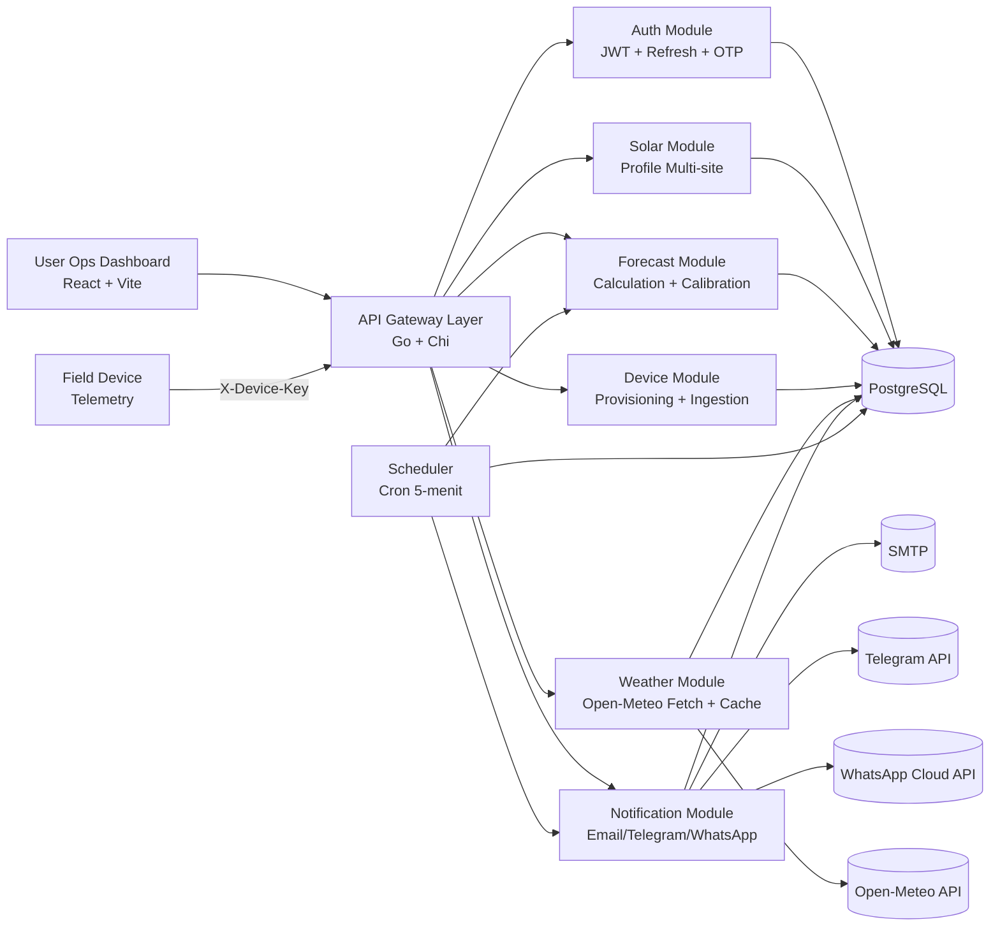
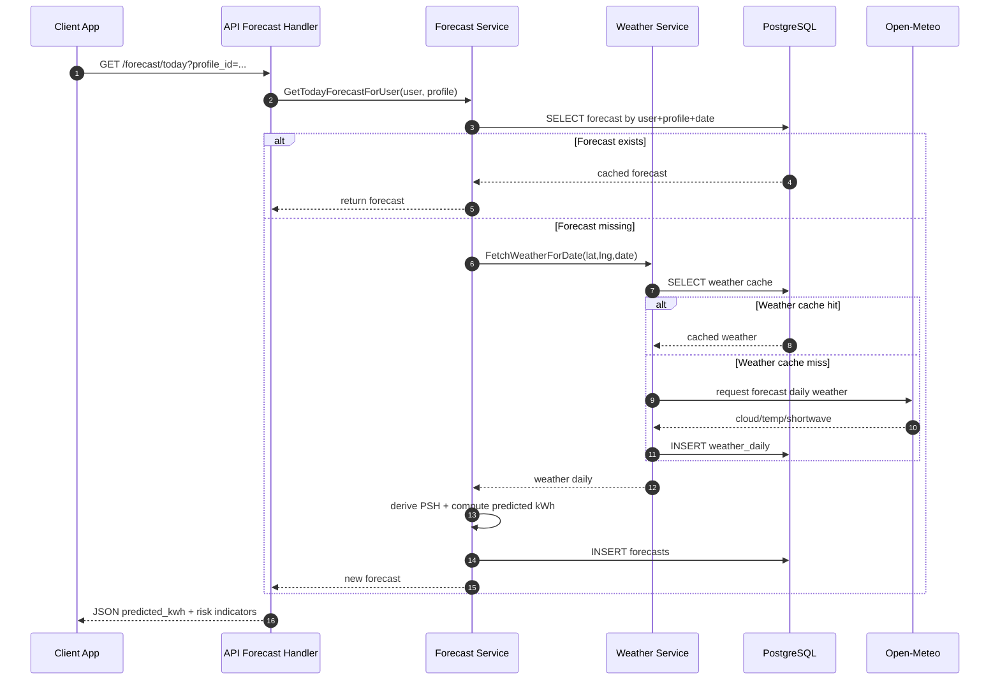

---

## Catatan Implementasi: Penggunaan Weather Factor

**Kapan Weather Factor digunakan dalam prediksi?**

- **Cold start (belum ada data actual):**
    - Weather Factor ($1 - \text{cloud\_cover}/100$) digunakan sebagai pengali prediksi agar hasil lebih konservatif saat cuaca buruk.
    - Rumus: $E_{pred} = P_{rated} \times PSH \times \eta \times \text{Weather Factor}$

- **Sudah ada data actual (mode terkalibrasi):**
    - Weather Factor tidak digunakan dalam rumus utama, karena efek cuaca sudah tercermin di PSH dan efficiency hasil kalibrasi.
    - Rumus: $E_{pred} = P_{rated} \times PSH \times \eta_{terkalibrasi}$

**Alasan:**
- Weather Factor mencegah overestimate pada cold start, tapi jika tetap digunakan saat sudah ada data real, bisa menyebabkan prediksi terlalu rendah (over-correction).

**Implementasi:**
- Sistem otomatis memilih rumus sesuai status data actual user/site.

# Naskah Slide Presentasi Teknis (14 Slide)

## Slide 1 - Judul dan Posisi Strategis

**Judul:** Solar Forecast untuk Operasi PLTS Tingkat Kota  
**Subjudul:** Arsitektur, akurasi prediksi, dan roadmap pembelajaran harian

**Narasi presenter:**

- Solar Forecast adalah platform operasional untuk memprediksi energi PLTS harian per site.
- Sistem dirancang agar hasil prediksi dapat langsung dipakai untuk tindakan lapangan, bukan hanya dashboard pasif.
- Fokus hari ini: bagaimana sistem bekerja di belakang layar, kenapa akurasi meningkat saat data real masuk, dan dasar ilmiah algoritmanya.

---

## Slide 2 - Masalah yang Diselesaikan

**Masalah utama di lapangan:**

- Produksi energi PLTS dipengaruhi cuaca, karakter panel, dan kondisi lokal setiap site.
- Forecast statis cepat meleset ketika kondisi aktual berubah.
- Tim operasional membutuhkan notifikasi yang tepat waktu sesuai timezone dan shift kerja.

**Dampak bila tidak ada sistem adaptif:**

- Over/under-estimate output energi.
- Keputusan operasional reaktif, bukan proaktif.
- Sulit membangun KPI akurasi yang konsisten antar site.

---

## Slide 3 - Solusi yang Ditawarkan

**Nilai produk:**

- Forecast harian per site berbasis data cuaca aktual.
- Integrasi data real dari input manual dan IoT telemetry.
- Kalibrasi efficiency harian untuk meningkatkan akurasi dari waktu ke waktu.
- Notifikasi otomatis lintas channel (email/telegram/whatsapp) dengan fallback.

**Nilai untuk manajemen kota:**

- Dasar keputusan operasional energi berbasis data.
- Transparansi kinerja dan akurasi per site.
- Fondasi agregasi lintas kecamatan/instansi.

---

## Slide 4 - Arsitektur Sistem (Mermaid)

Gunakan diagram berikut langsung di deck:



---

## Slide 5 - Alur End-to-End Forecast Harian

**Flow operasional:**

1. User pilih site/profile.
2. API cek cache cuaca harian (`weather_daily`).
3. Jika cache miss, ambil dari Open-Meteo lalu simpan.
4. Hitung PSH dari radiasi harian.
5. Hitung energi prediksi menggunakan efficiency user terkini.
6. Simpan ke `forecasts` (unik per user-site-date).
7. Tampilkan ke dashboard + kirim notifikasi saat due.

**Kunci desain:**

- Cache-first untuk efisiensi API eksternal.
- Scope ketat per user/site untuk keamanan multi-tenant.

---

## Slide 6 - Sequence Flow Backend (Mermaid)

Gunakan sequence berikut langsung di deck:



---

## Slide 7 - Formula dan Asumsi Teknis

**Formula produksi (conditional):**

- **Tanpa data real (cold start):**

$$
E_{pred} = P_{rated} \times PSH \times \eta \times \text{Weather Factor}
$$

- **Dengan data real (sudah ada actual):**

$$
E_{pred} = P_{rated} \times PSH \times \eta_{terkalibrasi}
$$

Dengan:

- $E_{pred}$: energi harian prediksi (kWh)
- $P_{rated}$: kapasitas PLTS terpasang (kWp)
- $PSH$: peak sun hours dari radiasi harian
- $\eta$: faktor efficiency efektif per user/site

**Konversi radiasi ke PSH:**

$$
PSH = \frac{H_{daily\ (MJ/m^2/day)}}{3.6}
$$

**Weather Factor:**

- Untuk cold start, Weather Factor digunakan sebagai pengali prediksi agar hasil lebih konservatif saat cuaca buruk:

  `weather_factor = 1 - cloud_cover/100`

- Untuk user yang sudah ada data actual, Weather Factor tidak digunakan dalam rumus utama (karena PSH dan efficiency sudah terkalibrasi).

---

## Slide 8 - Tanpa Data Real vs Dengan Data Real

**A. Tanpa data real (cold start):**

- Efficiency default (mis. 0.8) cenderung generik.
- Weather Factor digunakan sebagai pengali prediksi agar lebih konservatif saat cloud cover tinggi.
- Error prediksi bisa tinggi karena belum menangkap karakter lokal (soiling, shading, inverter losses nyata).
- Akurasi relatif stabil tapi plateau.

**Diagram Alur Data: Forecast Tanpa Data Real**

```mermaid
flowchart TD
    subgraph User
        U1[User pilih site]
    end
    subgraph Backend
        W1[Ambil data cuaca harian (cache/Open-Meteo)]
        P1[Ambil profile panel (capacity, lokasi, dsb)]
        F1[Hitung PSH & prediksi energi (dikali Weather Factor)]
        E1[Efficiency default (mis. 0.8)]
        WF1[Weather Factor dari cloud cover]
        S1[Simpan forecast ke DB]
    end
    U1 --> W1
    U1 --> P1
    W1 --> F1
    P1 --> F1
    E1 --> F1
    WF1 --> F1
    F1 --> S1
    S1 --> U1
```

> **Catatan:** Weather Factor hanya digunakan pada cold start (belum ada data actual). Jika sudah ada data real, prediksi hanya memakai efficiency terkalibrasi.

**B. Dengan data real (manual + IoT):**

- Sistem mengkalibrasi efficiency harian dari selisih actual vs forecast.
- Error menurun seiring bertambahnya data valid.
- Akurasi menjadi spesifik per user/site.

**Diagram Alur Data: Forecast Dengan Data Real (Kalibrasi Adaptive)**

```mermaid
flowchart TD
    subgraph User
        U2[User pilih site]
        A1[Input actual harian (manual/IoT)]
    end
    subgraph Backend
        W2[Ambil data cuaca harian (cache/Open-Meteo)]
        P2[Ambil profile panel]
        F2[Hitung PSH & prediksi energi]
        E2[Efficiency hasil kalibrasi]
        S2[Simpan forecast ke DB]
        C1[Bandingkan actual vs forecast]
        L1[Update efficiency (learning)]
    end
    U2 --> W2
    U2 --> P2
    W2 --> F2
    P2 --> F2
    E2 --> F2
    F2 --> S2
    S2 --> U2
    A1 --> C1
    S2 --> C1
    C1 --> L1
    L1 --> E2
```

**Implikasi bisnis:**

- Data real bukan sekadar pelaporan; ini bahan bakar peningkatan kualitas model.

---

## Slide 9 - Mekanisme Learning Harian (ML Ringan)

**Pendekatan saat ini: online adaptive calibration (setara online learning 1 parameter).**

Langkah update:

1. Ambil forecast dan actual pada tanggal referensi.
2. Hitung correction rate:

$$
r_t = \frac{E_{actual,t}}{E_{pred,t}}
$$

3. Hitung target efficiency:

$$
\eta^*_t = \eta_t \times r_t
$$

4. Update halus dengan learning rate $\alpha = 0.2$:

$$
\eta_{t+1} = (1-\alpha)\eta_t + \alpha\eta^*_t
$$

5. Clamp agar stabil: $0.6 \le \eta \le 0.95$.

**Kenapa disebut ML harian?**

- Parameter model berubah otomatis berdasarkan data observasi baru setiap hari.
- Termasuk kategori online learning / recursive update yang ringan, explainable, dan production-friendly.

---

## Slide 10 - Bagaimana Akurasi Meningkat dalam Praktik

**Fase akurasi yang umum terjadi:**

- Minggu 1-2: error masih tinggi (cold start, sedikit data real).
- Minggu 3-6: error mulai turun karena efficiency mendekati karakter sistem nyata.
- > 6 minggu: akurasi lebih stabil; outlier biasanya karena cuaca ekstrem/telemetry gap.

**Metrik yang direkomendasikan untuk governance:**

- MAPE per site
- MAE kWh harian
- Bias (%) prediksi (over/under)
- Coverage data actual (berapa persen hari memiliki actual valid)

**Pesan ke manajemen:**

- Akurasi bukan angka statis; ia fungsi dari kualitas dan konsistensi data real.

---

## Slide 11 - Validasi Keilmuan dan Rujukan Teknis

**Apakah formula ini mengacu jurnal?**

- Ya, fondasinya berasal dari literatur solar forecasting dan PV performance modeling.
- Implementasi saat ini adalah baseline fisik + kalibrasi online (bukan black-box AI).

**Rujukan ilmiah utama yang relevan:**

1. Yang, D., et al. (2018). _History and trends in solar irradiance and PV power forecasting_. Renewable and Sustainable Energy Reviews.
2. Antonanzas, J., et al. (2016). _Review of photovoltaic power forecasting_. Solar Energy.
3. Voyant, C., et al. (2017). _Machine learning methods for solar radiation forecasting: A review_. Renewable Energy / RSER literature stream.
4. Dobos, A. (2014). _PVWatts Version 5 Manual_ (NREL Technical Report).
5. Duffie, J. A., & Beckman, W. A. _Solar Engineering of Thermal Processes_ (konversi energi radiasi dan dasar perhitungan solar energy).
6. Haykin, S. _Adaptive Filter Theory_ (landasan adaptive update / recursive learning).

Catatan penting untuk slide presentasi:

- Sistem kita tidak mengklaim memakai model deep learning kompleks saat ini.
- Nilai kuatnya adalah explainable adaptive forecasting yang siap di-audit dan hemat komputasi.

---

## Slide 12 - Keamanan, Kepatuhan, dan Keandalan

**Keamanan:**

- JWT + refresh token untuk user access.
- OTP email verification sebelum login penuh.
- API key device disimpan sebagai hash (SHA-256), bukan plaintext.

**Keandalan:**

- Cache cuaca mengurangi ketergantungan API eksternal.
- Scheduler 5 menit berbasis due-window timezone.
- Penanda `last_daily_forecast_sent_for_date` mencegah notifikasi dobel.
- Migrasi DB otomatis saat service boot.

---

## Slide 13 - Roadmap: Dari Adaptive Model ke ML Lanjutan

**Tahap sekarang (sudah jalan):**

- Model fisik sederhana + online efficiency calibration.

**Tahap berikut (disarankan):**

1. Feature enrichment:

- Irradiance historis, temperatur, cloud dynamics, seasonality.

2. Model candidate:

- Gradient boosting / quantile regression untuk forecast + uncertainty band.

3. MLOps ringan:

- Retrain mingguan, monitor drift, rollback model.

4. City-scale analytics:

- Aggregasi per wilayah dan ranking performa site.

**Prinsip:**

- Naik kelas AI bertahap berdasarkan maturitas data, bukan sekadar mengikuti hype.

---

## Slide 14 - Penutup dan Ajakan Implementasi

**Kesimpulan utama:**

- Arsitektur saat ini sudah production-oriented: aman, modular, dan siap skala bertahap.
- Data real adalah pengungkit terbesar untuk peningkatan akurasi.
- Pendekatan adaptive harian memberi jalur ROI cepat sambil menyiapkan fondasi ML lebih lanjut.

**Call to action untuk stakeholder:**

1. Standarisasi input actual harian di seluruh site prioritas.
2. Perluas integrasi telemetry untuk meningkatkan coverage data real.
3. Tetapkan KPI akurasi resmi (MAPE/MAE/Bias) untuk evaluasi triwulanan.

---

## Lampiran - Catatan Presenter (Opsional)

**Jawaban singkat saat ditanya "seberapa ilmiah model ini?"**

- Formula inti menggunakan praktik standar energi surya (capacity x PSH x efficiency) yang umum di literatur teknik energi dan praktik industri PV.
- Mekanisme pembelajaran harian memakai online adaptive update yang memiliki dasar kuat di teori adaptive filtering/recursive estimation.
- Ini adalah strategi engineering yang robust: explainable dulu, kemudian ditingkatkan ke ML kompleks saat data siap.
